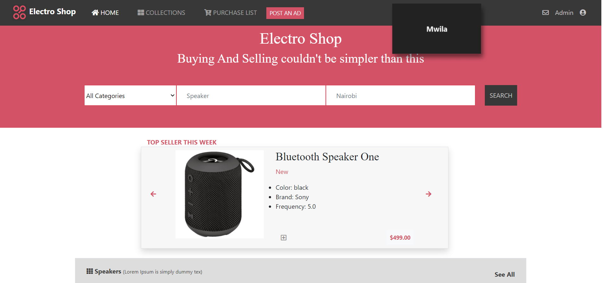

# Electronic shop

> This is an electronic shop project.

Additional description about the project and its features.

## Built With

- HTML
- CSS
- BOOTSTRAP
- coffee

## Live Demo

[Live Demo Link](https://livedemo.com)

## Authors

👤 **Anass**

- Twitter: [@twitterhandle](https://twitter.com/AnassTantane)
- LinkedIn: [LinkedIn](https://www.linkedin.com/in/anass-tantane)
- GitHub: [@githubhandle](https://github.com/rockerbell)

## Getting Started

**This is an example of how you may give instructions on setting up your project locally.**
**Modify this file to match your project, remove sections that don't apply. For example: delete the testing section if the currect project doesn't require testing.**

## 🤝 Contributing

Contributions, issues, and feature requests are welcome!

Feel free to check the [issues page](issues/).

## Show your support

Give a ⭐️ if you like this project!

## Acknowledgments

- Hat tip to anyone whose code was used
- Inspiration
- etc

## 📝 License

This project is [MIT](lic.url) licensed.